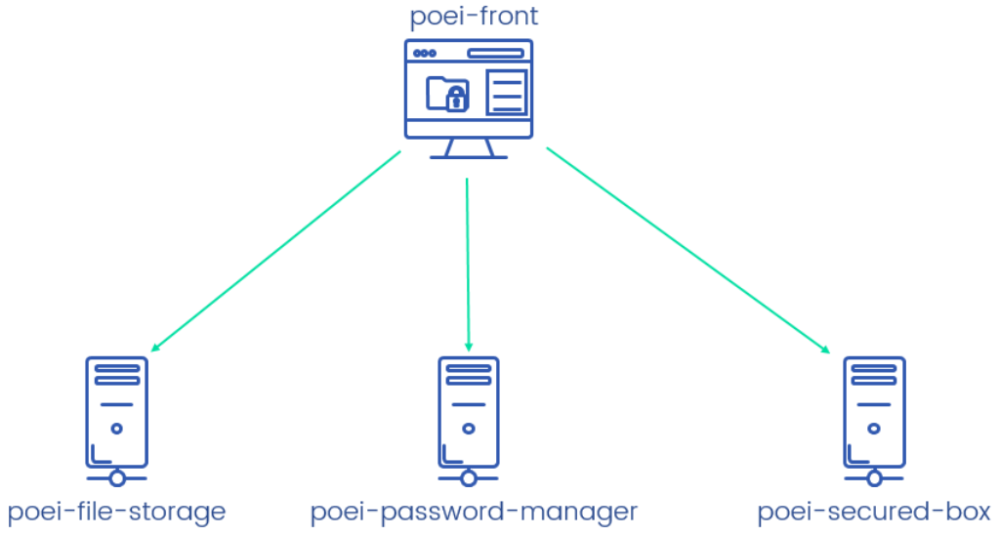

# POEI

> Préparation Opérationnelle à l'Emploi Individuelle

This repository will be used as projects to develop by the people in POEI formation to evaluate
their capacity to think, communicate and develop the services as a team.

## Context

Nowadays, security is playing an increasingly important role in the world. Scandals such as
[facebook storing plaintext password][] or [Internet privacy scandals][], to name but a few,
can seriously damage the company's brand. 

Thus it is now paramount for a company to be concerned about security and to develop
countermeasures and mitigations to prevent security design flaws, application threats and
vulnerabilities.

The projects to develop will also be served to raise awareness about security issues while maintaining
practical code.

## Projects to develop

As a whole, you will develop a dashboard which deals with some general security consideration:

- [secured file storage](poei-file-storage)
- [password generation & password complexity verification](poei-password-manager)
- [secured box to store secret messages](poei-secured-box)

Each service will expose HTTP APIs that will be consumed by a web application `poei-front`:

Each service will be developed by a team of 2 or 3. The service must respect the contract defined in
the specifications, i.e. given a HTTP request, the service must return the corresponding HTTP response.

[facebook storing plaintext password]: https://www.zdnet.com/article/facebook-admits-to-storing-plaintext-passwords-for-millions-of-instagram-users/
[Internet privacy scandals]: https://www.networkworld.com/article/2185187/15-worst-internet-privacy-scandals-of-all-time.html

