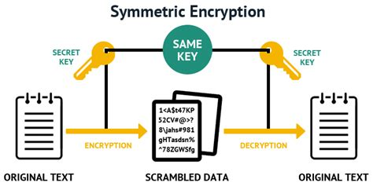

# File storage service

> Backend service to store files

# Contract

You will need to develop the following HTTP APIs:

- API to upload a file
- API to download a file

## File upload

**HTTP Request (input)**

```
POST http://localhost:8080/file-storage/file
```

- Content of the file in the parameter `file`

**Expected HTTP Responses (output)**

- HTTP Status: 200
- Response body (JSON):

```json
{
  "fileId": 1,
  "name": "poei.pdf"
}
```

## File download

**HTTP Request (input)**

```
GET http://localhost:8080/file-storage/file/{fileId}
```

Path variable:

|Name|Type|Description|
|----|----|-----------|
|`fileId`|integer|The file id to download|

**Expected HTTP Responses (output)**

- HTTP Status: 200
- File download

# Getting started
## Running the service with Maven

```bash
mvn clean spring-boot:run
```

## Running the service with the IDE

Main class: `com.oodrive.poei.filestorage.PoeiFileStorageApplication`

# Exercises
## 1 - File upload

**Goal**

> Expose a HTTP API to upload files

The path to call the HTTP API must be the following:

```
POST http://localhost:8080/file-storage/file
```

- Content of the file in the parameter `file`

The output of the HTTP request must be the following:

- HTTP Status: 200
- Response body (JSON):

```json
{
  "fileId": 1,
  "name": "poei.pdf"
}
```

**Instructions**

- Create Java classes:
  - to represents a file entity without its content (id, file name, absolute path to the stored file)
  - to store the file entities in memory
  - to store a file in file system
    - :bulb: you can use the `Files.createTempFile()` API to create the files in a temporary directory
    - :bulb: track the file absolute path so you can fetch them again when we will download them
- Create a controller that uses the previous Java classes

## 2 - File download

**Goal**

> Expose a HTTP API to download files

The path to call the HTTP API must be the following:

```
GET http://localhost:8080/file-storage/file/{fileId}
```

Path variable:

|Name|Type|Description|
|----|----|-----------|
|`fileId`|integer|The file id to download|

The output of the HTTP request must be the following:

- HTTP Status: 200
- File download

**Instructions**

- Create Java classes:
  - that fetch a file entity from a given file id
  - that fetch the file content from the path provided by the file entity
- Update the controller to download the file
  - return a HTTP Status `404` if the file does not exist
  - :bulb: you can use the Spring annotation `@ResponseStatus` on an exception to return the corresponding HTTP status

## 3 - Save file entities in database

**Goal**

> Storing file entities in memory is easy to develop, however, the data created will be purged when the application stops.
>
> We will then store file entities in database in order to persist the data after each restart.

**Instructions**

- Modify the `pom.xml` file to use the dependencies `spring-boot-starter-jdbc` and `postgresql`
  - :warning: the application is already configured to use the database `file_storage`, so you may have to create the database beforehand
- Create a table that will contain the file entities
- Create the Java DAO class that read and write lines in the database
- Update the Java classes to store, update and fetch the file entities in database instead of in memory

## 4 - Encrypt/Decrypt file content

**Goal**

> For security purpose, the file content must not be in plain text readable by a human.
>
> One way is to encrypt the file content using a common cryptographic technique: symmetric encryption.
>
> The principle is to use an encryption key to convert a sensitive data into a non-readable data by employing
> a two-way algorithm, i.e. the encryption and decryption are performed using the same encryption key.



**Instructions**

- Create Java classes to:
  - generate an encryption key supported by `AES` (Advanced Encryption Standard) implementation
    - you can use the Java class `SecretKey` for the encryption key
    - the storage of the encryption key's password is up to you
      - directly in the code
      - in the database
      - using Spring `@Value`
    - :warning: `AES` only supports 16, 24 or 32 bytes blocks, so fill up the block if the length of the given password is not enough
    - :bulb: SHA-256 hashes are also 32 bytes long, so you can hash your password to use it to create the `SecretKey`
  - encrypt file content
    - you can use the Java class `CipherOutputStream`
  - decrypt file content
    - you can use the Java class `CipherInputStream`
- Update your code to include the encryption and decryption of file contents

