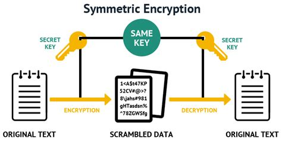

# Secured box service

> Backend service to store secured messages

# Contract

You will need to develop the following HTTP APIs:

- API to create / update a secret
- API to read a secret

:warning: The secret must not be human readable and should be
encrypted using a given password.

## Create / Update a secret

**HTTP Request (input)**

```
POST http://localhost:8080/secured-box/secret
```

- Request body (JSON):

```json
{
  "key": "foobar",
  "value": "Hello, world",
  "password": "poei"
}
```

Request parameters:

|Name|Type|Description|
|----|----|-----------|
|`key`|String|The key representing the secret|
|`value`|String|The content of the secret|
|`password`|String|The password used to access to the secret|

**Expected HTTP Responses (output)**

- HTTP Status: 201
- No response body

## Read secret

**HTTP Request (input)**

```
POST http://localhost:8080/secured-box/secret/{key}
```

Path variable:

|Name|Type|Description|
|----|----|-----------|
|`key`|String|The key representing the secret|

- Request body (JSON):

```json
{
  "password": "poei"
}
```

Request parameters:

|Name|Type|Description|
|----|----|-----------|
|`password`|String|The password used to access to the secret|

**Expected HTTP Responses (output)**

If the secret does not exist for a given key:

- HTTP Status: 404
- Response body (JSON): use Spring default response

If the password is not correct:

- HTTP Status: 403
- Response body (JSON): use Spring default response

If everything went well:

- HTTP Status: 200
- Response body (JSON):

```json
{
  "value": "Hello, world"
}
```

# Getting started
## Running the service with Maven

```bash
mvn clean spring-boot:run
```

## Running the service with the IDE

Main class: `com.oodrive.poei.securedbox.PoeiSecuredBoxApplication`

# Exercises
## 1 - Secret generation

**Goal**

> Expose a HTTP API to generate or update a secret.

The path to call the HTTP API must be the following:

```
POST http://localhost:8080/secured-box/secret
```

- Request body (JSON):

```json
{
  "key": "foobar",
  "value": "Hello, world",
  "password": "poei"
}
```

Request parameters:

|Name|Type|Description|
|----|----|-----------|
|`key`|String|The key representing the secret|
|`value`|String|The content of the secret|
|`password`|String|The password used to access to the secret|

The output of the HTTP request must be the following:

- HTTP Status: 201
- No response body

**Instructions**

- Create Java classes to:
  - represent a secret
  - store and update secrets in memory
- Create a controller that uses the Java classes to generate or update a secret

## 2 - Secret fetcher

**Goal**

> Expose a HTTP API to fetch a secret.

The path to call the HTTP API must be the following:

```
POST http://localhost:8080/secured-box/secret/{key}
```

Path variable:

|Name|Type|Description|
|----|----|-----------|
|`key`|String|The key representing the secret|

- Request body (JSON):

```json
{
  "password": "poei"
}
```

Request parameters:

|Name|Type|Description|
|----|----|-----------|
|`password`|String|The password used to access to the secret|

The output of the HTTP request must be the following:

```json
{
  "value": "Hello, world"
}
```

**Instructions**

- Update your code to be able to fetch secret from a given key
- Update the controller to add a new endpoint to fetch a secret from a key
  - return a HTTP Status `404` if a secret does not exist from a given key
  - return a HTTP Status `403` if the given password is not valid (i.e. not equals to the one provided at the secret creation)
  - :bulb: you can use the Spring annotation `@ResponseStatus` on an exception to return the corresponding HTTP status

## 3 - Save secrets in database

**Goal**

> Storing secrets in memory is easy to develop, however, the data created will be purged when the application stops.
>
> We will then store secrets in database in order to persist the data after each restart.

**Instructions**

- Modify the `pom.xml` file to use the dependencies `spring-boot-starter-jdbc` and `postgresql`
  - :warning: the application is already configured to use the database `secured_box`, so you may have to create the database beforehand
- Create a table that will contain the secrets
- Create the Java DAO class that read and write lines in the database
- Update the Java classes to store, update and fetch the secrets in database instead of in memory

## 4 - Encrypt secret values

**Goal**

> For security purpose, the secret values must not be in plain text readable by a human in the database.
>
> One way is to encrypt the secret value using a common cryptographic technique: symmetric encryption.
>
> The principle is to use an encryption key to convert a sensitive data into a non-readable data by employing
> a two-way algorithm, i.e. the encryption and decryption are performed using the same encryption key.



**Instructions**

- Create Java classes to:
  - generate a secret key from a given password supported by `AES` (Advanced Encryption Standard) implementation
    - :warning: `AES` only supports 16, 24 or 32 bytes blocks, so fill up the block if the length of the given password is not enough
  - generate the encrypted secret value from the secret value given in the request and the generated secret key
- Update your database and DAO classes if needed
- Update your code to include the encryption and decryption of the secret value and store the encrypted data instead of the value

## 5 - Password hashing

**Goal**

> When creating the secret key used to encrypt the message, if the password's length is not enough to fill up the whole
> bytes blocks needed for `AES`, you filled up the content with some padding bytes. It's called the "padding method".
>
> Another approach is to use the password's hash instead of the password value to create the secret key as the hash in SHA-256 is
> 256 bits long, i.e. 32 bytes long. 
>
> The hashing technique will always result the same output for a given input, in other words, for a given password value,
> its hash value will always be the same. So, it's also possible to check if a password has already been used or not.
> 
> :warning: This approach is not the best way to create a secret key, but it's one of the easiest way to create one, enough for this exercise.

**Instructions**

- Create the Java classes that hash a given `String` and return the hashed `byte[]`
  - you will use the algorithm `SHA256` to hash
- Update your code to create the secret key using the password hash instead of the password value

## 6 - Salted password hashing

**Goal**

> Enforce the security by randomizing the secret key value.
>
> Using the previous method with hashes, the issue is that the encrypted messages are the same if we are using the same
> password and the same message. So it will be possible to notice in the database which messages are identical.
>
> One way is to randomize the hashes by appending or prepending a String, called **salt**, to the password before hashing.
> Thus, for each encryption and secret message, we are ensured that the secret key used is unique (the risk of collision
> is so small we don't have to worry), even if the password and the secret message are the same.
>
> In order to decrypt the secret message, the salt is needed to re-build the secret key, so the salt must also be stored
> in the database along with the encrypted secret message.
>
> ```
>           ----------                   ---------------                             -------------------
> hello -> | add salt | -> 3ab4hello -> | hash function | -> a12a3b30f3fc9327... -> | store salt & hash |
>           ----------                   ---------------                             -------------------
> ```

**Instructions**

- Update your database & DAO classes to include the salt
- Create the Java classes to generate a random salt
  - :bulb: you can use the `new SecureRandom().nextBytes()` to generate random bytes
- Update your code to use the salt when encrypting the secret message

## 7 - Obfuscate password

**Goal**

> It's best practice to use `char[]` instead of `String` when manipulating passwords. Indeed, `String` are immutable,
> which means you can't manually obfuscate it by assigning a new `String` value as the old value will continue to live
> until the garbage collector passes.
>
> Example:
>
> ```java
> String password = "mysupersecret";
> password = "imtryingtoobfuscatethepassword";
> // the old value "mysupersecret" still lives in the heap of the java process
> ```
>
> Whereas `char[]` is not immutable, so it's possible to overwrite the content and the password value will no longer be
> present in the heap.
>
> Why is it important to obfuscate the password value after you're done with it?
>
> It's possible to obtain head dumps from Java application. Heap dumps are snapshots of the memory of the Java process,
> which means it's possible to read the password values in `String` in those heap dumps. In other words, if an attacker
> manages to fetch a heap dump of your Java application, the attacker will be able to fetch the passwords.

**Instructions**

- Update your Java classes to use `char[]` instead of `String` for the password and secret values
- Update your Java classes to overwrite the value of the password values with ` ` characters after you're done with it and assign the password value to `null`

